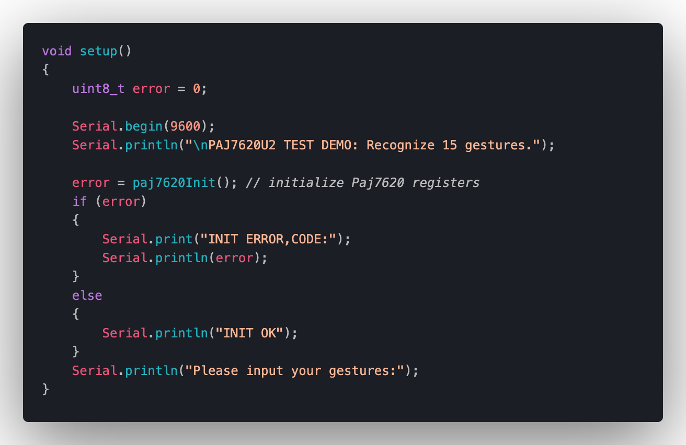
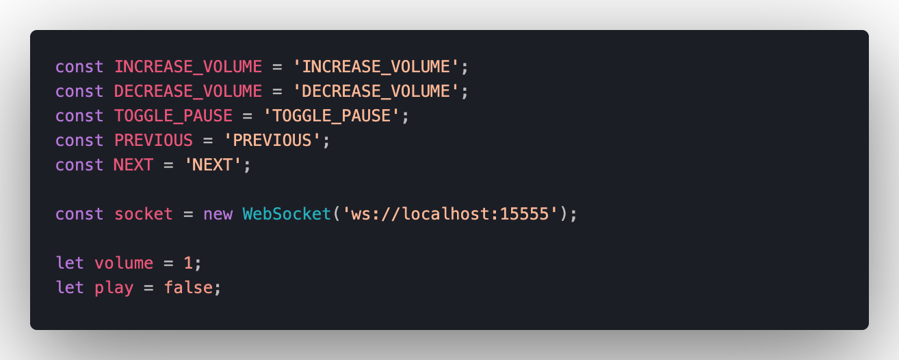

# Gesture Media Controller

A project accomplished by Computer Engineering students of Sharif University of Techology.

The contributor names (alphabetical order):
- [Amir Hasan Fathi](https://github.com/ahfathi)
- [Mostafa Ghadimi](https://github.com/mostafaghadimi)
- [Parsa Alian](https://github.com/parsaalian)


# Table of Content

- [Gesture Media Controller](#gesture-media-controller)
- [Table of Content](#table-of-content)
- [Usages](#usages)
- [Physical Modules](#physical-modules)
- [Introduction](#introduction)
- [Requirements](#requirements)
- [How to use](#how-to-use)
- [Code](#code)
  - [PAJ7620U2](#paj7620u2)
  - [ESP8266](#esp8266)
  - [Web  Client](#web-socket-client)
- [Challenges](#challenges)
  - [DEMO VIDEO](#demo-video)


# Usages

Since it's a really simple implementation of media control using gesture detector, it has wide variety of usages such as car manufacturing. It can also implemented for different approaches not only controling media. 

- BMW Gesture Control is an innovative feature that is available in select BMW models and will allow drivers to use simple hand gestures to perform various actions in the vehicle with 3D technology – turn the volume up or down, accept or decline a phone call, change the rearview camera angle or select navigation on the BMW iDrive infotainment system.


# Physical Modules

- **NodeMCU**


- **Jumper Wires** 


- **PAJ7620**


# Introduction

Gestures have become an essential part of our daily lives since the introduction of touch-screen mobile phones. Since the introduction of these actions, they have made our lives much more comfortable since every gesture is a shortcut, and it is easier for our minds to memorize them since they become muscle memory after a while. As technology moves forth, we are introduced to new possibilities, one of which is touchless gestures. Nowadays, we have access to various sensors that can help the development of such technologies easier.

[](https://www.youtube.com/watch?v=SVwV4uqETbI)

In this project, we aimed to utilize this concept to control media. Since it's a straightforward implementation of media control using a gesture detector, it can handle various usages, such as car manufacturing, where the driver can control the music without further distractions. As another example, it can get integrated with smart homes to act as a remote controller for TV or stereo to facilitate the owners’ lives.

# Requirements

The explained concept consists of three major parts:

1. The gesture sensor
2. A wireless module to transmit the gestures
3. A software to receive the data and transform them into actions

As we have described in our preliminary report, we used the following modules to construct our sensor to satisfy the description and project requirements.

| Module      | Description |
| :---        |    :----:   |
| Arduino Uno board      | The main module that connects all other modules of the project       |
| PAJ7620U2 sensor   | The gesture detection sensor        |
| ESP8266   | WiFi module        |
| Cable   | Connect Arduino board to the computer        |


```
#COLOR MAPPING
RED: VCC - 3.3v
BLACK: GND
ORANGE: SCL - D1
GREEN: SDA - D2
```

**Note:** If your module doesn't work properly, see the *Challenges* section.

The flow of the sensor can be described as following.

1. The person moves his hand in front of the gesture sensor.
2. The gesture is captured and processed on the Arduino board.
3. The gesture gets translated into the action performed by the person.
4. The WiFi module receives the action.
5. The module transmits the action to the software present on a device, using a socket.
6. The device receives the action and acts accordingly.
7. 
We have depicted this flow in the following figure.


# How to use

1. The jumper wires should be connect the boards (Node-MCU and PAJ7620) like the following scheme:

| paj7620       | nodemcu       |
| ------------- |:-------------:|
| VCC           | 3.3v          |
| GND           | GND           |
| SCL           | D1            |
| SDA           | D2            |


2. Node-MCU tries to connect a WiFi. Change the following parameters to your SSID and Wifi password in `gesture.ino` file.

```
WiFi.begin("<Your-SSID>", "<Your-WiFi-Password>");
```

1. Find your IP and assign it to `host` variable in `gesture.ino`:

```
const char * host = "<YOUR_IP>";
```


4. Execute python code with running the following command in terminal:
```
python3 socket_server.py
```

**Note:** Make sure you have `python` installed on your computer.


# Code

In the distinct phases, we have implemented the code for each of the modules.

## PAJ7620U2

First, we define gesture timings and import header files.


-- description



-- description


## ESP8266

TODO

## Web Socket Client

After connecting the modules in the previous sections, we need to connect them to a client in order to control a media player. We used [howler.js](https://github.com/goldfire/howler.js) as the base javascript library to create a music player.


The player is controlled by events. We create a websocket on the player side in order to translate Arduino transferred data into music player actions.




Each case converts the input from the socket server into an action.


# Challenges

At first, we were trying to assemble the circuit using `Arduino Uno` micro-controller, `PAJ7620` gesture detector and `ESP8266-01` wifi module. We have found that the `ESP8266-01` module is very sensitive to voltage, requires some voltage regulator modules and have complex unresolved issues which we've faced to them after trying to connect it and found too many links that none of them work properly for us. Therefore we have decided to use `NodeMCU` micro-controller instead of `Arduino Uno` and `ESP8266`. Because it has a built-in wifi module on it. 

It is valuable to see the following issues:
- [Connecting PAJ7620 to NodeMCU](https://arduino.stackexchange.com/questions/81294/cant-connect-paj7620-gesture-detector-module-to-nodemcu/81302#81302)
- [Port is disabled in Arduino IDE](https://github.com/esp8266/Arduino/issues/3551): In short, just try different cables!

> "The A4 and A5 on the UNO are where the ATMega328P's I2C bus signals happen to be. Earlier versions of the Arduino UNO and related boards didn't have dedicated SDA and SCL headers as they do now. On those UNO that have SDA and SCL pins on the upper digital header, they are the same exact signal as those found on A4 and A5."


> ESP8266 with Arduino UNO error: Timed out waiting for packet header
This error was resolved after changing the cable! You can see more details [here](https://github.com/esp8266/Arduino/issues/3551).


## DEMO VIDEO
```
TODO://
```
